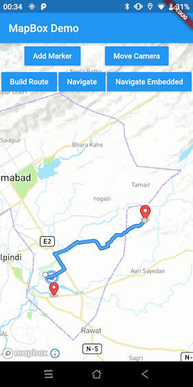
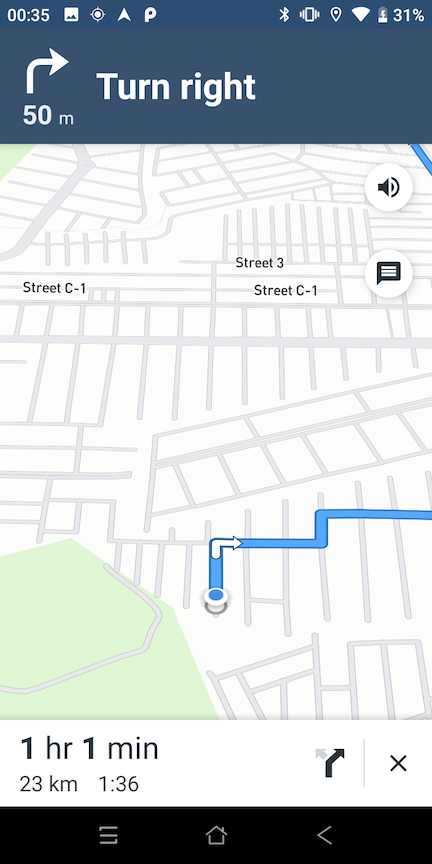
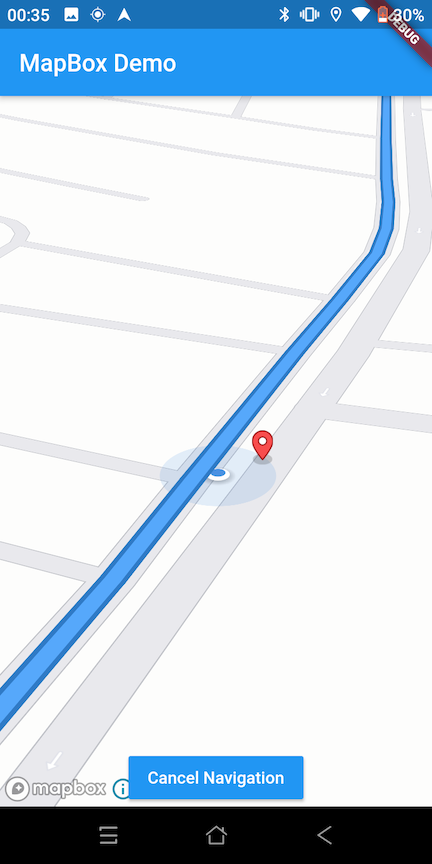

# mapbox_navigation
#### A Flutter plugin for MapBox's Navigation SDK, NavigationView & Navigation services. (Android)
##### iOS Support comming soon.

[](https://pub.dev/packages/mapbox_navigation)

Overview
--------

This plugin is developed to use advance features of MapBox for Flutter apps. This plugin provides all the basic features of MapBox along with some useful callbacks.

<table style="padding:10px">
  <tr>
    <td>
    <h5>Generate Route</h5>
    </td>
    <td>
    <h5>Built-in Navigation</h5>
    </td>
    <td>
    <h5>Embedded Navigation</h5>
    </td>
  </tr>
</table>

Features
--------

- MapBox Map View UI
- MapBox's Navigation UI
- Add markers on Map
- Move camera to location on Map
- Draw route on Map
- Start Navigation (Built-In)
- Start Navigation (Embedded)
- Simulate Route Option
- Listen to Navigation Events
- Listen to User Off Route Event
- Listen to Fast Route Available
- Listen to Voice Events
- Listen to Banner Messages
- Listen to Route Progress Events (Distance, Duration, Travelled & more)
- Listen to Mile stone Events
- Control Camera zoom, tile, bearing


## Install
In your pubspec.yaml

```yaml
dependencies:
    mapbox_navigation: [LATEST_VERSION]
```

```dart
    import 'package:mapbox_navigation/mapbox_navigation.dart';
```

```dart
    MapViewController controller;
    var mapBox = MapboxNavigation();

    @override
    void initState() {
        super.initState();
        mapBox.init();

        mapBox.getMapBoxEventResults().onData((data) {
            print("Event: ${data.eventName}, Data: ${data.data}");

            var event = MapBoxEventProvider.getEventType(data.eventName);

            if (event == MapBoxEvent.route_building) {

                print("Building route..");

            } else if (event == MapBoxEvent.route_build_failed) {

                print("Route building failed.");

            } else if (event == MapBoxEvent.route_built) {
                var routeResponse = MapBoxRouteResponse.fromJson(jsonDecode(data.data));

                controller.getFormattedDistance(routeResponse.routes.first.distance)
                    .then((value) => print("Route Distance: $value"));

                controller.getFormattedDuration(routeResponse.routes.first.duration)
                    .then((value) => print("Route Duration: $value"));

            } else if (event == MapBoxEvent.progress_change) {


                var progressEvent = MapBoxProgressEvent.fromJson(jsonDecode(data.data));

                controller.getFormattedDistance(progressEvent.legDistanceRemaining)
                    .then((value) => print("Leg Distance Remaining: $value"));

                controller.getFormattedDistance(progressEvent.distanceTraveled)
                    .then((value) => print("Distance Travelled: $value"));

                controller.getFormattedDuration(progressEvent.legDurationRemaining)
                    .then((value) => print("Leg Duration Remaining: $value"));

                print(
                    "Voice Instruction: ${progressEvent.voiceInstruction},"
                    "Banner Instruction: ${progressEvent.bannerInstruction}");

            } else if (event == MapBoxEvent.milestone_event) {

                var mileStoneEvent = MapBoxMileStoneEvent.fromJson(jsonDecode(data.data));

                controller.getFormattedDistance(mileStoneEvent.distanceTraveled)
                    .then((value) => print("Distance Travelled: $value"));

            } else if (event == MapBoxEvent.speech_announcement) {

                var speechEvent = MapBoxEventData.fromJson(jsonDecode(data.data));
                print("Speech Text: ${speechEvent.data}");

            } else if (event == MapBoxEvent.banner_instruction) {

                var bannerEvent = MapBoxEventData.fromJson(jsonDecode(data.data));
                print("Banner Text: ${bannerEvent.data}");

            } else if (event == MapBoxEvent.navigation_cancelled) {


            } else if (event == MapBoxEvent.navigation_finished) {


            } else if (event == MapBoxEvent.on_arrival) {


            } else if (event == MapBoxEvent.user_off_route) {

                var locationData = MapBoxLocation.fromJson(jsonDecode(data.data));
                print("User has off-routed: Location: ${locationData.toString()}");

            } else if (event == MapBoxEvent.faster_route_found) {

                var routeResponse = MapBoxRouteResponse.fromJson(jsonDecode(data.data));

                controller.getFormattedDistance(routeResponse.routes.first.distance)
                    .then((value) => print("Faster route found: Route Distance: $value"));

                controller.getFormattedDuration(routeResponse.routes.first.duration)
                    .then((value) => print("Faster route found: Route Duration: $value"));
            }
        });
    }

    @override
    Widget build(BuildContext context) {
        return MaterialApp(
        home: Scaffold(
            appBar: AppBar(
            title: const Text('MapBox Demo'),
            ),
            body: MapBoxMapView(onMapViewCreated: _onMapViewCreated)
        ),
        );
    }

    void _onMapViewCreated(MapViewController controller) async {
        this.controller = controller;
        await controller.showMap(MapBoxOptions(
            initialLat: 33.569126,
            initialLong: 73.1231471,
            enableRefresh: false,
            alternatives: true,
            zoom: 13.0,
            tilt: 0.0,
            bearing: 0.0,
            clientAppName: "MapBox Demo",
            voiceInstructions: true,
            bannerInstructions: true,
            continueStraight: true,
            profile: "driving-traffic",
            language: "en",
            testRoute: "",
            debug: true));
    }
```

## Android

##### Step 1:
Change your Android Project's *MainActivity* class to following:

```kotlin
    import androidx.annotation.NonNull
    import com.umair.mapbox_navigation.MapboxNavigationPlugin
    import io.flutter.embedding.android.FlutterActivity
    import io.flutter.embedding.engine.FlutterEngine
    import io.flutter.plugins.GeneratedPluginRegistrant


    class MainActivity : FlutterActivity() {

        companion object {

            @JvmStatic
            var flutterEngineInstance: FlutterEngine? = null
        }

        override fun configureFlutterEngine(@NonNull flutterEngine: FlutterEngine) {
            GeneratedPluginRegistrant.registerWith(flutterEngine)
            flutterEngineInstance = flutterEngine
        }

        override fun onResume() {
            super.onResume()

            flutterEngineInstance?.let {
                MapboxNavigationPlugin.registerWith(it, getString(R.string.access_token))
            }
        }

        override fun onDestroy() {
            flutterEngine?.platformViewsController?.onFlutterViewDestroyed()
            super.onDestroy()
        }
    }
```

##### Step 2:
Add your MapBox's token on *strings.xml* file:

```xml
    <string name="access_token" translatable="false">YOUR_ACCESS_TOKEN_HERE</string>
```

## Flutter

### Build Route:

This will build route based on origin & destination values provided.

```dart
    await controller.buildRoute(
        originLat: 33.569126,
        originLong: 73.1231471,
        destinationLat: 33.6392443,
        destinationLong: 73.278358,
        zoom: 9.5
    );
```

### Start Navigation (Built-In):

This will start navigation based on route fetched using 'buildRoute' method.

```dart
    await controller.startNavigation(shouldSimulateRoute: true);
```

### Start Navigation (Embedded):

This will start navigation on the MapBox's MapView without opening seperate screen.

```dart
    await controller.startEmbeddedNavigation(
                        zoom: 18.0,
                        tilt: 90.0,
                        bearing: 50.0,
                        shouldSimulateRoute: false);
```

### Add Marker:

This will add marker on provided location.

```dart
    await controller.addMarker(
        latitude: 33.569126, 
        longitude: 73.1231471);
```

### Move Camera:

This will move camera to provided location.

```dart
    await controller.moveCameraToPosition(
            latitude: 33.569126, 
            longitude: 73.1231471);
```

### Format Distance:

This will return formatted distance in meters/Kilometers.

```dart
    controller.getFormattedDistance(88777.99)
            .then((value) => print("Distance: $value"));
```

### Format Duration:

This will return formatted duration hh/mm/ss.

```dart
    controller.getFormattedDuration(88777.99)
            .then((value) => print("Duration: $value"));
```

### MapBox Events:

MapBox events from 'MapBoxEvent' will be returned in the following stream along with data. Data will be a JSON String.

```dart
    enum MapBoxEvent {
        map_ready,
        route_built,
        progress_change,
        user_off_route,
        milestone_event,
        navigation_running,
        navigation_cancelled,
        navigation_finished,
        faster_route_found,
        speech_announcement,
        banner_instruction,
        on_arrival,
        failed_to_reroute,
        reroute_along
    }

    mapBox.getMapBoxEventResults().onData((data) {
      print(
          "Event: ${data.eventName} Data: ${data.data}");
    });
```

_______________________________________________

# Author

MapBox Navigation plugin is developed by Umair Adil. You can email me at <m.umair.adil@gmail.com> for any queries.

